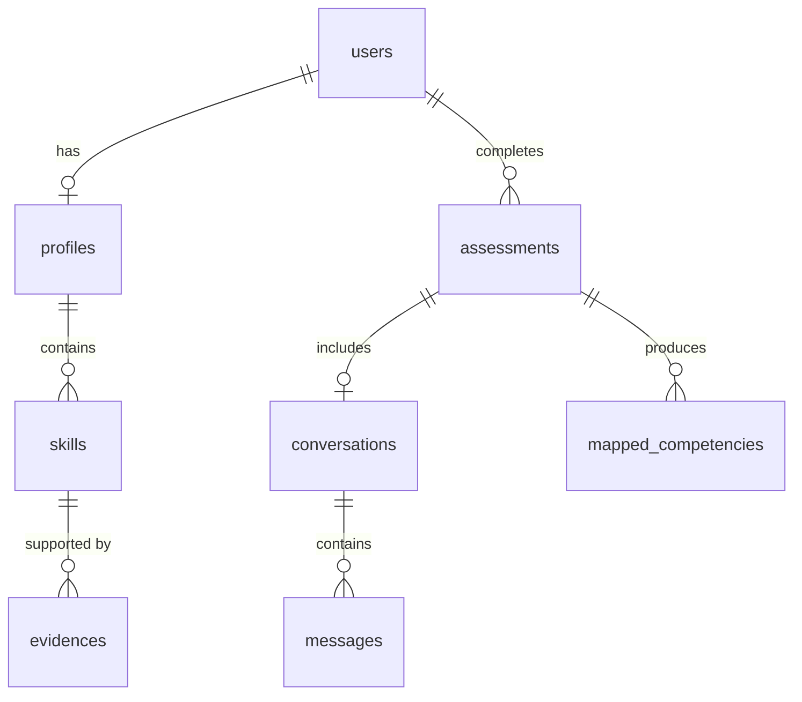

# Database Layer Implementation Summary

This document provides a complete overview of the database layer implementation for the competency assessment system. The database layer is built using SQLAlchemy ORM and designed to be database-agnostic, allowing easy migration from SQLite to PostgreSQL, MySQL, or other databases.

## 🏗️ Architecture Overview

The database layer follows a clean architecture pattern with clear separation of concerns:

```
Backend/database/
├── __init__.py              # Package exports and convenience functions
├── config.py               # Database configuration management
├── connection.py           # Connection and session management
├── models.py               # SQLAlchemy ORM models
├── repositories.py         # Concrete repository implementations
├── migrations.py           # Migration and schema management
├── example_usage.py        # Comprehensive examples
└── requirements.txt        # Database dependencies
```

## 📊 Database Schema

### Core Tables

| Table | Purpose | Key Relationships |
|-------|---------|-------------------|
| `users` | User accounts and authentication | → profiles, assessments |
| `profiles` | Detailed user profile information | → users, skills |
| `skills` | Individual competencies and skills | → profiles, evidences |
| `evidences` | Supporting evidence for skills | → skills |
| `assessments` | Competency assessment sessions | → users, conversations, mapped_competencies |
| `conversations` | Chat conversations within assessments | → assessments, messages |
| `messages` | Individual messages in conversations | → conversations |
| `mapped_competencies` | Framework-mapped competencies | → assessments |
| `schema_migrations` | Migration tracking (system table) | - |

### Database Relationships



## 🔧 Key Features

### 1. Database Agnostic Design
- **SQLAlchemy ORM**: Works with SQLite, PostgreSQL, MySQL, Oracle, SQL Server
- **Connection URL Support**: Easy switching between databases
- **Driver Abstraction**: Automatic driver selection based on database type

### 2. Type Safety & Validation
- **Custom GUID Type**: Platform-independent UUID handling
- **Enum Integration**: Proper enum mapping for status fields
- **JSON Field Support**: Flexible metadata storage
- **Timezone Awareness**: All timestamps use UTC with timezone info

### 3. Advanced Features
- **Connection Pooling**: Configurable connection pools for production
- **Transaction Management**: Automatic transaction handling with rollback
- **Migration System**: Schema versioning and migration tracking
- **Session Management**: Context managers for safe session handling

## 🚀 Quick Start

### Basic Setup
```python
from Backend.database import DatabaseConfig, DatabaseManager, create_repositories

# Configure database (SQLite for development)
config = DatabaseConfig.sqlite("competency_assessment.db")

# Create database manager
db_manager = DatabaseManager(config)

# Initialize database with tables
db_manager.create_tables()

# Create repositories
repositories = create_repositories(db_manager)
user_repo = repositories['user']
assessment_repo = repositories['assessment']
skill_repo = repositories['skill']
```

### Production Setup (PostgreSQL)
```python
# Production configuration
config = DatabaseConfig.postgresql(
    host="localhost",
    database="competency_assessment",
    username="app_user",
    password="secure_password",
    pool_size=20,
    pool_timeout=60
)

db_manager = DatabaseManager(config)
```

### Environment-Based Configuration
```python
# Set environment variables
# DB_TYPE=postgresql
# DB_HOST=localhost
# DB_DATABASE=competency_assessment
# DB_USERNAME=app_user
# DB_PASSWORD=secure_password

config = DatabaseConfig.from_environment()
db_manager = DatabaseManager(config)
```

## 📝 Repository Pattern

The implementation follows the Repository pattern with abstract interfaces and concrete SQLAlchemy implementations:

### Interface Definition
```python
from Backend.repositories.interfaces import UserRepository

class UserRepository(ABC):
    @abstractmethod
    def save(self, user: User) -> bool: ...
    @abstractmethod
    def find_by_id(self, user_id: str) -> Optional[User]: ...
    @abstractmethod
    def find_by_email(self, email: str) -> Optional[User]: ...
    # ... other methods
```

### Concrete Implementation
```python
from Backend.database.repositories import SQLUserRepository

class SQLUserRepository(BaseSQLRepository, UserRepository):
    def save(self, user: User) -> bool:
        # SQLAlchemy-specific implementation
        # Handles both insert and update operations
        # Includes proper error handling and transactions
```

### Usage Example
```python
# Create user with profile and skills
user = User(email="user@example.com", password_hash="hashed_password")
user.profile = Profile(
    user_id=user.id,
    first_name="John",
    last_name="Doe"
)

# Save using repository
if user_repo.save(user):
    print("User saved successfully")

# Query operations
user = user_repo.find_by_email("user@example.com")
users_by_role = user_repo.find_by_role(UserRole.ADMIN)
```

## 🔄 Migration System

### Migration Definition
```python
from Backend.database.migrations import Migration, MigrationManager

def create_user_index_migration():
    def up_operation(db_manager):
        # Add database index
        with db_manager.session_scope() as session:
            session.execute("CREATE INDEX idx_users_email ON users(email)")
        return True
    
    def down_operation(db_manager):
        # Remove database index
        with db_manager.session_scope() as session:
            session.execute("DROP INDEX idx_users_email")
        return True
    
    return Migration(
        version="002",
        name="add_user_email_index",
        description="Add index on users.email for faster lookups",
        up_operation=up_operation,
        down_operation=down_operation
    )
```

### Migration Management
```python
# Initialize migration manager
migration_manager = MigrationManager(db_manager)

# Add migrations
migration_manager.add_migration(create_user_index_migration())

# Apply pending migrations
migration_manager.apply_all_pending()

# Check migration status
status = migration_manager.get_migration_status()
print(f"Applied: {status['applied_count']}, Pending: {status['pending_count']}")
```

## 💾 Connection Management

### Session Patterns

#### Transaction Scope
```python
# Automatic transaction management
with db_manager.session_scope() as session:
    user = session.query(UserModel).filter_by(email="user@example.com").first()
    user.last_login = datetime.now(timezone.utc)
    # Automatically commits on success, rolls back on exception
```

#### Session Manager
```python
from Backend.database.connection import SessionManager

with SessionManager(db_manager) as session:
    # Use session for queries
    users = session.query(UserModel).all()
```

#### Manual Session Management
```python
session = db_manager.create_session()
try:
    # Perform operations
    session.commit()
except Exception:
    session.rollback()
finally:
    session.close()
```

## 🔍 Advanced Querying

### Repository Query Examples
```python
# Complex user queries
inactive_users = user_repo.find_by_last_login_before(
    datetime.now() - timedelta(days=30)
)

# Assessment statistics
stats = assessment_repo.get_statistics()
# Returns: {
#   "total_assessments": 150,
#   "status_distribution": {"completed": 120, "in_progress": 30},
#   "average_duration_seconds": 1800.5
# }

# Skill analytics
popular_skills = skill_repo.find_popular_skills(limit=10)
skill_stats = skill_repo.get_skill_statistics(user_id="user-123")
```

### Custom Queries with SQLAlchemy
```python
with db_manager.session_scope() as session:
    # Complex join query
    results = session.query(UserModel, ProfileModel, SkillModel)\
        .join(ProfileModel)\
        .join(SkillModel)\
        .filter(SkillModel.level == ProficiencyLevel.EXPERT)\
        .all()
```

## 🛡️ Error Handling

### Repository Exceptions
```python
from Backend.repositories.interfaces import RepositoryError, NotFoundException

try:
    user = user_repo.find_by_id("non-existent-id")
    if not user:
        raise NotFoundException("User", "non-existent-id")
except NotFoundException as e:
    print(f"User not found: {e.identifier}")
except RepositoryError as e:
    print(f"Database error: {e}")
```

### Transaction Rollback
```python
try:
    with db_manager.session_scope() as session:
        # Multiple operations
        user = UserModel(email="test@example.com")
        session.add(user)
        
        # Simulated error
        raise Exception("Something went wrong")
        
except Exception:
    # Session automatically rolled back
    print("Transaction rolled back safely")
```

## 📈 Performance Optimization

### Connection Pooling
```python
config = DatabaseConfig.postgresql(
    host="localhost",
    database="competency_assessment",
    username="app_user",
    password="secure_password",
    pool_size=20,          # Base pool size
    pool_timeout=60,       # Connection timeout
    pool_recycle=3600,     # Recycle connections after 1 hour
)
```

### Query Optimization
```python
# Use joinedload for eager loading
with db_manager.session_scope() as session:
    user = session.query(UserModel).options(
        joinedload(UserModel.profile).joinedload(ProfileModel.skills)
    ).filter_by(id=user_id).first()
```

### Bulk Operations
```python
# Bulk save skills
skills = [Skill(...) for _ in range(100)]
success = skill_repo.bulk_save(skills)
```

## 🧪 Testing

### Test Database Setup
```python
from Backend.database.migrations import setup_test_database

def test_user_operations():
    # Create in-memory test database
    db_manager = setup_test_database()
    repositories = create_repositories(db_manager)
    
    # Test operations
    user_repo = repositories['user']
    # ... test code ...
```

### Example Test Pattern
```python
import pytest
from Backend.database import DatabaseConfig, DatabaseManager

@pytest.fixture
def test_db():
    config = DatabaseConfig.sqlite(":memory:")
    db_manager = DatabaseManager(config)
    db_manager.create_tables()
    yield db_manager
    db_manager.close()

def test_user_creation(test_db):
    user_repo = SQLUserRepository(test_db)
    user = User(email="test@example.com", password_hash="hash")
    
    assert user_repo.save(user)
    retrieved = user_repo.find_by_email("test@example.com")
    assert retrieved is not None
    assert retrieved.email == "test@example.com"
```

## 🔧 Configuration Options

### Database Types
- **SQLite**: Development and testing
- **PostgreSQL**: Production (recommended)
- **MySQL**: Production alternative
- **Oracle**: Enterprise environments
- **SQL Server**: Microsoft environments

### Configuration Methods
1. **Direct Configuration**: `DatabaseConfig.postgresql(...)`
2. **URL-based**: `DatabaseConfig.from_url("postgresql://...")`
3. **Environment Variables**: `DatabaseConfig.from_environment()`
4. **Configuration Presets**: `ConfigPresets.development()`

### Environment Variables
```bash
# Database configuration
DB_TYPE=postgresql
DB_HOST=localhost
DB_PORT=5432
DB_DATABASE=competency_assessment
DB_USERNAME=app_user
DB_PASSWORD=secure_password
DB_POOL_SIZE=20
DB_ECHO=false
```

## 📦 Dependencies

### Core Requirements
- `sqlalchemy>=2.0.0` - ORM and database abstraction
- `alembic>=1.8.0` - Database migrations (optional)

### Database Drivers
- `psycopg2-binary` - PostgreSQL
- `pymysql` - MySQL
- `cx-oracle` - Oracle
- `pyodbc` - SQL Server

### Installation
```bash
pip install sqlalchemy psycopg2-binary  # For PostgreSQL
# or
pip install -r Backend/requirements.txt  # All drivers
```

## 🚀 Deployment Considerations

### Production Checklist
- [ ] Use PostgreSQL or MySQL instead of SQLite
- [ ] Configure appropriate connection pool settings
- [ ] Set up database monitoring and logging
- [ ] Implement backup and recovery procedures
- [ ] Use environment variables for configuration
- [ ] Set up migration deployment pipeline
- [ ] Configure SSL/TLS for database connections

### Scaling Considerations
- **Read Replicas**: Use separate read/write connections
- **Connection Pooling**: Tune pool sizes based on load
- **Query Optimization**: Add indexes for frequent queries
- **Caching**: Implement application-level caching
- **Monitoring**: Track query performance and connection usage

This database layer provides a solid foundation for the competency assessment system with room for growth and easy maintenance. The modular design allows for easy testing, deployment, and future enhancements. 