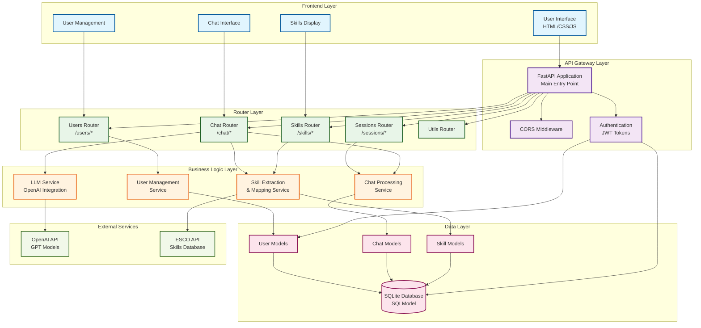
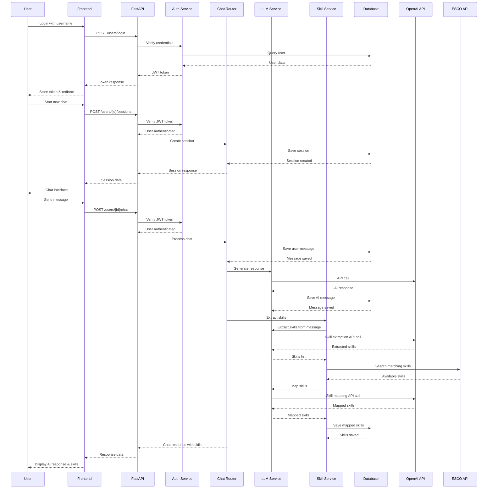
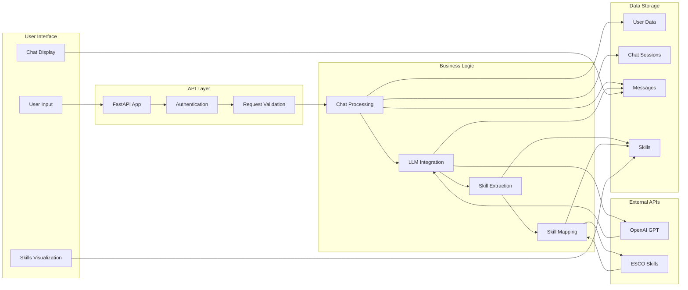
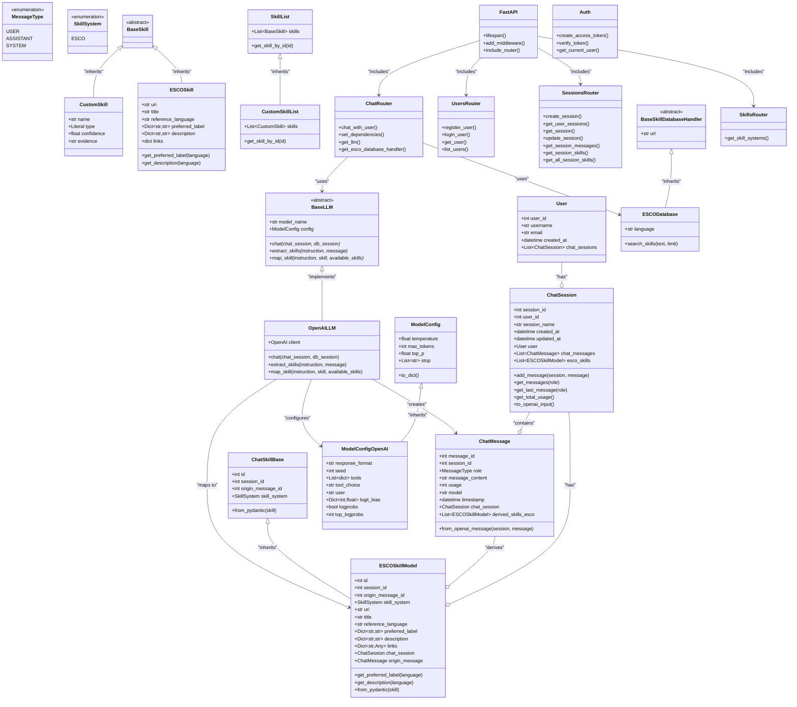
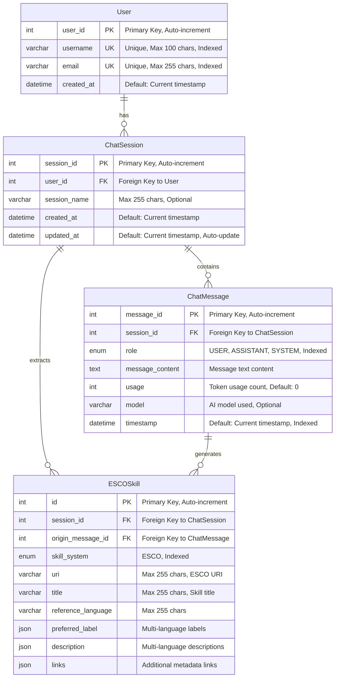

# AI-Powered Skill Assessment Chatbot - Demo Version v1.0

## Project Overview

This bachelor's thesis aims to develop an interactive chatbot that identifies and assesses user qualifications based on structured questionnaires derived from two established competency models: the European ESCO (European Skills, Competences, Qualifications and Occupations) framework and the Austrian Freiwilligenpass competency model. The chatbot is designed for use in volunteer platforms, where it can support organizations in identifying the skills and competencies of volunteers more effectively and efficiently.

The system will offer two operation modes—one tailored to each of the competency models—allowing users to switch depending on the context or platform requirements. It leverages large language models (LLMs) with carefully designed prompt engineering techniques to guide conversations, ask meaningful questions, and map user responses to the relevant qualifications. A custom web-based interface will be developed to facilitate interaction with the chatbot, enabling users to engage in a natural and intuitive dialogue.

In addition to the conversational functionality, the system will support persistent data storage, enabling competencies to be saved for later reference and analysis. The platform will include visualization capabilities, such as radar charts, to provide an at-a-glance overview of a user's skill profile.

The evaluation of the system will be conducted through qualitative testing using a small set of predefined demo personas, focusing on usability and whether the chatbot behaves as intended. This project contributes to the growing field of AI-assisted skill profiling and offers a novel, low-barrier approach to capturing informal and non-formal competencies in the volunteering sector.

**⚠️ Note: This is currently a Demo Version v1.0 - a proof of concept implementation for academic research purposes.**

## 🚀 Features

- **AI-Powered Conversations**: Natural language interaction using OpenAI GPT models
- **Dual Competency Models**: Support for ESCO and Freiwilligenpass frameworks
- **Skill Extraction**: Automatic identification and mapping of user competencies
- **Persistent Storage**: Complete conversation history and skill profiles
- **Web Interface**: Modern, responsive web application
- **JWT Authentication**: Secure user management and session handling
- **Real-time Processing**: Immediate AI responses and skill extraction
- **Export Functionality**: Multiple format options for skills data

## 🏗️ System Architecture

### System Architecture Diagram



### Data Flow Diagram



### Component Interaction Diagram



## 👥 User Flow

### Main User Flow Diagram

```mermaid
flowchart TD
    Start([User arrives at application]) --> Landing{First time user?}
    
    %% New User Path
    Landing -->|Yes| Register[Register new account]
    Register --> EnterDetails[Enter username & email]
    EnterDetails --> ValidateRegistration{Validation successful?}
    ValidateRegistration -->|No| ShowError[Show error message]
    ShowError --> EnterDetails
    ValidateRegistration -->|Yes| AccountCreated[Account created successfully]
    
    %% Existing User Path
    Landing -->|No| Login[Login with existing account]
    Login --> EnterCredentials[Enter username]
    EnterCredentials --> ValidateLogin{Valid credentials?}
    ValidateLogin -->|No| ShowLoginError[Show login error]
    ShowLoginError --> EnterCredentials
    ValidateLogin -->|Yes| GenerateToken[Generate JWT token]
    
    %% Common Path After Authentication
    AccountCreated --> GenerateToken
    GenerateToken --> Dashboard[User Dashboard]
    
    %% Dashboard Options
    Dashboard --> DashboardChoice{What would you like to do?}
    
    %% Start New Chat
    DashboardChoice -->|Start New Chat| NewChat[Create new chat session]
    NewChat --> EnterSessionName[Enter session name optional]
    EnterSessionName --> ChatInterface[Chat Interface]
    
    %% Continue Existing Chat
    DashboardChoice -->|Continue Chat| ViewSessions[View existing sessions]
    ViewSessions --> SelectSession[Select chat session]
    SelectSession --> ChatInterface
    
    %% View Skills
    DashboardChoice -->|View Skills| SkillsOverview[Skills Overview]
    SkillsOverview --> SkillsBySession[View skills by session]
    SkillsBySession --> SelectSessionForSkills[Select session]
    SelectSessionForSkills --> DisplaySkills[Display extracted skills]
    DisplaySkills --> BackToDashboard[Return to Dashboard]
    
    %% Profile Management
    DashboardChoice -->|Manage Profile| ProfileOptions{Profile action?}
    ProfileOptions -->|View Profile| ShowProfile[Display user profile]
    ProfileOptions -->|Edit Profile| EditProfile[Edit profile information]
    EditProfile --> SaveProfile[Save changes]
    SaveProfile --> ProfileUpdated[Profile updated]
    ShowProfile --> BackToDashboard
    ProfileUpdated --> BackToDashboard
    
    %% Chat Interface Flow
    ChatInterface --> ChatChoice{Chat action?}
    
    %% Send Message
    ChatChoice -->|Send Message| TypeMessage[Type message]
    TypeMessage --> ValidateMessage{Message valid?}
    ValidateMessage -->|No| ShowMessageError[Show validation error]
    ShowMessageError --> TypeMessage
    ValidateMessage -->|Yes| SendMessage[Send message to AI]
    
    %% AI Processing
    SendMessage --> AIProcessing[AI processing...]
    AIProcessing --> ExtractSkills[Extract skills from message]
    ExtractSkills --> MapSkills[Map to ESCO skills]
    MapSkills --> GenerateResponse[Generate AI response]
    
    %% Display Results
    GenerateResponse --> DisplayResponse[Display AI response]
    DisplayResponse --> DisplaySkillsInChat[Display extracted skills]
    DisplaySkillsInChat --> ContinueChat{Continue chatting?}
    
    %% Continue or End Chat
    ContinueChat -->|Yes| ChatChoice
    ContinueChat -->|No| EndChat[End chat session]
    EndChat --> SaveSession[Save session data]
    SaveSession --> SessionSaved[Session saved]
    SessionSaved --> BackToDashboard
    
    %% Session Management
    ViewSessions --> SessionAction{Session action?}
    SessionAction -->|Open Session| SelectSession
    SessionAction -->|Delete Session| ConfirmDelete[Confirm deletion]
    ConfirmDelete --> DeleteSession[Delete session]
    DeleteSession --> SessionDeleted[Session deleted]
    SessionDeleted --> ViewSessions
    SessionAction -->|Rename Session| RenameSession[Enter new name]
    RenameSession --> UpdateSessionName[Update session name]
    UpdateSessionName --> NameUpdated[Name updated]
    NameUpdated --> ViewSessions
    
    %% Return to Dashboard
    BackToDashboard --> DashboardChoice
    
    %% Logout
    DashboardChoice -->|Logout| ConfirmLogout[Confirm logout]
    ConfirmLogout --> Logout[Clear session & logout]
    Logout --> Start
    
    %% Styling
    classDef startEnd fill:#ff6b6b,stroke:#d63031,stroke-width:3px,color:#fff
    classDef process fill:#74b9ff,stroke:#0984e3,stroke-width:2px,color:#fff
    classDef decision fill:#fdcb6e,stroke:#e17055,stroke-width:2px,color:#000
    classDef data fill:#55a3ff,stroke:#2d3436,stroke-width:2px,color:#fff
    classDef error fill:#fd79a8,stroke:#e84393,stroke-width:2px,color:#fff
    classDef success fill:#00b894,stroke:#00a085,stroke-width:2px,color:#fff
    
    class Start,EndChat,Logout startEnd
    class Register,Login,EnterDetails,EnterCredentials,NewChat,EnterSessionName,ChatInterface,TypeMessage,SendMessage,AIProcessing,ExtractSkills,MapSkills,GenerateResponse,DisplayResponse,DisplaySkillsInChat,SaveSession,ViewSessions,SelectSession,SkillsOverview,SkillsBySession,SelectSessionForSkills,DisplaySkills,ShowProfile,EditProfile,SaveProfile,DeleteSession,RenameSession,UpdateSessionName process
    class Landing,ValidateRegistration,ValidateLogin,ValidateMessage,DashboardChoice,ContinueChat,SessionAction,ProfileOptions,ConfirmDelete,ConfirmLogout decision
    class Dashboard,AccountCreated,GenerateToken,ProfileUpdated,SessionSaved,SessionDeleted,NameUpdated data
    class ShowError,ShowLoginError,ShowMessageError error
    class ChatInterface,DisplayResponse,DisplaySkillsInChat success
```



## 🏛️ System Design

### Class Diagram



### Class Descriptions

#### Database Models
- **User**: Represents application users with authentication and chat session management
- **ChatSession**: Manages chat conversations and their associated messages and skills
- **ChatMessage**: Individual messages within chat sessions with metadata
- **ESCOSkillModel**: ESCO skill mappings extracted from chat conversations
- **ChatSkillBase**: Abstract base class for different skill system implementations

#### Core Classes
- **BaseLLM**: Abstract base class for LLM implementations
- **OpenAILLM**: Concrete OpenAI API implementation
- **BaseSkill**: Abstract base for skill representations
- **ESCOSkill**: ESCO skill data structure
- **CustomSkill**: User-defined skill extraction

#### Configuration & Handlers
- **ModelConfig**: Base configuration for LLM models
- **ModelConfigOpenAI**: OpenAI-specific configuration options
- **BaseSkillDatabaseHandler**: Abstract base for skill database handlers
- **ESCODatabase**: ESCO API integration for skill search

#### FastAPI Components
- **FastAPI**: Main application instance
- **UsersRouter**: User management endpoints
- **SessionsRouter**: Chat session management
- **ChatRouter**: Core chat functionality
- **SkillsRouter**: Skill-related endpoints
- **Auth**: JWT authentication and user verification

### Relationships

- **Composition**: Users have chat sessions, sessions contain messages and skills
- **Inheritance**: Multiple classes extend abstract base classes
- **Association**: Routers use LLM and database handlers
- **Dependency**: FastAPI includes various router modules

## 🗄️ Database Design

### Database Schema Diagram



### Database Configuration

- **Database Engine**: SQLite (configurable to PostgreSQL/MySQL)
- **ORM**: SQLAlchemy with SQLModel
- **Migration**: Automatic schema generation
- **Connection Pooling**: Configurable pool settings
- **Environment Variables**: Database URL and configuration overrides

## 🛠️ Technology Stack

### Frontend
- **HTML/CSS/JavaScript**: Static web interface
- **Chat Interface**: Real-time chat functionality
- **User Management**: Registration, login, profile
- **Skills Display**: Visual representation of extracted skills

### Backend
- **FastAPI**: Modern Python web framework
- **SQLModel**: SQL database ORM with Pydantic
- **JWT Authentication**: Secure user authentication
- **CORS Middleware**: Cross-origin resource sharing

### AI Integration
- **OpenAI API**: GPT model integration
- **Custom Prompts**: Skill extraction and mapping
- **Response Parsing**: Structured output handling

### Data Management
- **SQLite Database**: Local data storage
- **ESCO API**: European Skills/Competences database
- **Skill Mapping**: AI-powered skill matching

### Architecture Patterns
- **RESTful API**: Standard HTTP endpoints
- **Dependency Injection**: Service layer management
- **Repository Pattern**: Data access abstraction
- **Middleware Architecture**: Request/response processing

## 📁 Project Structure

```
BachelorThesis/
├── app.py                          # Main application entry point
├── Backend/                        # Backend Python application
│   ├── __init__.py
│   ├── api.py                     # FastAPI application setup
│   ├── auth.py                    # JWT authentication
│   ├── classes/                   # Core business logic classes
│   │   ├── __init__.py
│   │   ├── LLM_Message.py
│   │   ├── LLM.py                 # LLM integration
│   │   ├── Model_Config.py        # Model configuration
│   │   ├── Skill_Classes.py       # Skill data structures
│   │   └── Skill_Database_Handler.py  # ESCO API integration
│   ├── database/                  # Database layer
│   │   ├── __init__.py
│   │   ├── config.py              # Database configuration
│   │   ├── init.py                # Database initialization
│   │   ├── models/                # Database models
│   │   │   ├── __init__.py
│   │   │   ├── messages.py        # Chat message models
│   │   │   ├── skills.py          # Skill models
│   │   │   └── users.py           # User models
│   │   └── utils.py               # Database utilities
│   ├── logging_config.py          # Logging configuration
│   ├── prompts.yaml               # AI prompt templates
│   ├── routers/                   # API route handlers
│   │   ├── __init__.py
│   │   ├── chat.py                # Chat functionality
│   │   ├── sessions.py            # Session management
│   │   ├── skills.py              # Skills management
│   │   ├── users.py               # User management
│   │   └── utils.py               # Utility endpoints
│   ├── schemas.py                 # Pydantic schemas
│   └── utils.py                   # Utility functions
├── Frontend/                       # Frontend web application
│   ├── chat.html                  # Chat interface
│   ├── documentation.html         # API documentation
│   ├── index.html                 # Main landing page
│   ├── js/                        # JavaScript files
│   │   ├── api.js                 # API client
│   │   ├── chat.js                # Chat functionality
│   │   └── config.js              # Configuration
│   ├── skills.html                # Skills visualization
│   ├── style.css                  # Styling
│   └── user.html                  # User management
├── pyproject.toml                 # Python project configuration
├── README.md                      # This file
└── uv.lock                        # Dependency lock file
```

## 🚀 Getting Started

### Prerequisites

- Python 3.13+
- OpenAI API key
- Modern web browser
- UV package manager (recommended) or pip

### Installation

1. Clone the repository
2. Install dependencies using UV (recommended):
   ```bash
   uv sync
   ```
   Or using pip:
   ```bash
   pip install -r requirements.txt
   ```
3. Set environment variables:
   - `OPENAI_API_KEY`: Your OpenAI API key (see Configuration section below)
4. Run the application: `python app.py`

### Usage

1. Open your browser and navigate to the application
2. Register a new account or login
3. Start a new chat session
4. Begin conversing with the AI chatbot
5. View extracted skills and competencies

## 🔧 Configuration

### Required Personal Information

**⚠️ IMPORTANT: You need to add your personal API keys and configuration before running the application.**

The application can be configured through environment variables:

- `OPENAI_API_KEY`: **REQUIRED** - Your OpenAI API key
  - Get your API key from: https://platform.openai.com/api-keys
  - This is mandatory for the AI chatbot functionality

### Optional Configuration

- `DATABASE_URL`: Database connection string (defaults to SQLite)
- `SECRET_KEY`: JWT secret key (auto-generated if not provided)
- `LOG_LEVEL`: Logging level (defaults to INFO)

## 📊 Evaluation

The system evaluation will be conducted through:

- **Qualitative Testing**: Using predefined demo personas
- **Usability Assessment**: Focus on user experience and interface design
- **Functional Testing**: Verification of intended chatbot behavior
- **Performance Analysis**: Response times and accuracy metrics

## 🤖 AI-Usage Disclaimer

This project was developed with assistance from various AI tools and services:

- **Cursor AI**: Used for code generation, debugging, and project structure optimization
- **ChatGPT**: Assisted with documentation, code review, and architectural decisions
- **Claude**: Helped with system design, database schema planning, and API integration

**Important**: While AI tools were used in the development process, all final decisions, code implementation, and project direction were made by the human developer. The AI tools served as collaborative assistants to accelerate development and improve code quality, but the project remains a human-created academic work.


## 🤝 Contributing

This is a Bachelor's thesis project. For academic purposes, please refer to the project documentation and contact the author for any questions.

## 📄 License

This project is part of a Bachelor's thesis and is intended for academic research and demonstration purposes.

## 👨‍🎓 Author

**Bachelor's Thesis Project**  
*AI-Powered Skill Assessment Chatbot for Volunteer Platforms*

---

*This project demonstrates the application of AI and LLM technologies in the field of skill assessment and competency mapping, specifically designed for volunteer organizations and platforms.*