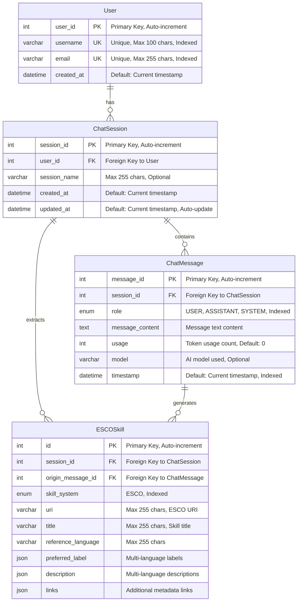

# Database Schema Diagram - AI Chatbot Application

## Overview
This diagram represents the complete database schema for the skill-extraction AI chatbot system, showing all tables, attributes, relationships, and constraints.

## Database Schema Diagram

## Table Details

### 1. **User Table** 👤
**Purpose**: Store user account information
- **Primary Key**: `user_id` (auto-increment)
- **Unique Constraints**: `username`, `email`
- **Indexes**: `username`, `email`
- **Relationships**: One-to-Many with ChatSession

### 2. **ChatSession Table** 💬
**Purpose**: Manage chat conversation sessions
- **Primary Key**: `session_id` (auto-increment)
- **Foreign Keys**: `user_id` → User
- **Indexes**: `user_id`
- **Relationships**: 
  - Many-to-One with User
  - One-to-Many with ChatMessage
  - One-to-Many with ESCOSkill

### 3. **ChatMessage Table** 📝
**Purpose**: Store individual chat messages
- **Primary Key**: `message_id` (auto-increment)
- **Foreign Keys**: `session_id` → ChatSession
- **Indexes**: `session_id`, `role`, `timestamp`
- **Enums**: `role` (USER, ASSISTANT, SYSTEM)
- **Relationships**:
  - Many-to-One with ChatSession
  - One-to-Many with ESCOSkill

### 4. **ESCOSkill Table** 🎯
**Purpose**: Store extracted skills from chat messages
- **Primary Key**: `id` (auto-increment)
- **Foreign Keys**: 
  - `session_id` → ChatSession
  - `origin_message_id` → ChatMessage
- **Indexes**: `session_id`, `origin_message_id`, `skill_system`
- **JSON Fields**: `preferred_label`, `description`, `links`
- **Relationships**:
  - Many-to-One with ChatSession
  - Many-to-One with ChatMessage

## Data Types & Constraints

| Field Type | SQL Type | Description |
|------------|----------|-------------|
| **Primary Keys** | `int` | Auto-incrementing unique identifiers |
| **Foreign Keys** | `int` | References to parent table primary keys |
| **Text Fields** | `varchar` | Variable-length strings with max limits |
| **Content Fields** | `text` | Long text content (messages) |
| **Date Fields** | `datetime` | Timestamp with automatic defaults |
| **Enum Fields** | `enum` | Predefined value sets |
| **JSON Fields** | `json` | Structured data storage |
| **Integer Fields** | `int` | Numeric values (usage counts) |

## Indexes & Performance

| Table | Indexed Fields | Purpose |
|-------|----------------|---------|
| **User** | `username`, `email` | Fast user lookup and authentication |
| **ChatSession** | `user_id` | Quick session retrieval by user |
| **ChatMessage** | `session_id`, `role`, `timestamp` | Efficient message querying and sorting |
| **ESCOSkill** | `session_id`, `origin_message_id`, `skill_system` | Fast skill retrieval and filtering |

## Key Features

### **Automatic Timestamps**
- `created_at`: Set on record creation
- `updated_at`: Auto-updated on session modifications

### **Referential Integrity**
- Foreign key constraints ensure data consistency
- Cascade relationships maintain data integrity

### **Flexible Content Storage**
- JSON fields for multi-language support
- Text fields for long message content
- Enum fields for structured data

### **Performance Optimization**
- Strategic indexing on frequently queried fields
- Efficient relationship loading with SQLModel
- Optimized query patterns for chat applications

## Database Configuration

- **Database Engine**: SQLite (configurable to PostgreSQL/MySQL)
- **ORM**: SQLAlchemy with SQLModel
- **Migration**: Automatic schema generation
- **Connection Pooling**: Configurable pool settings
- **Environment Variables**: Database URL and configuration overrides
