# System Architecture Diagram - AI Chatbot Application

## Overview
This diagram represents the architecture of a skill-extraction AI chatbot system with a Python FastAPI backend, JavaScript frontend, and SQLite database integration.

## Architecture Diagram

```mermaid
graph TD
    %% User Interface Layer
    User[👤 User] --> Frontend[🌐 Frontend<br/>HTML/CSS/JavaScript<br/>Single Page Application]
    
    %% Frontend Components
    Frontend --> ChatUI[💬 Chat Interface<br/>chat.html + chat.js]
    Frontend --> UserUI[👤 User Management<br/>user.html]
    Frontend --> SkillsUI[🎯 Skills Display<br/>skills.html]
    Frontend --> API_Client[🔌 API Client<br/>api.js + config.js]
    
    %% API Layer
    API_Client --> Backend[🚀 Backend API<br/>FastAPI + Uvicorn<br/>Port 8000]
    
    %% Backend Components
    Backend --> Auth[🔐 Authentication<br/>JWT + bcrypt<br/>auth.py]
    Backend --> ChatRouter[💬 Chat Router<br/>chat.py]
    Backend --> UsersRouter[👥 Users Router<br/>users.py]
    Backend --> SessionsRouter[📝 Sessions Router<br/>sessions.py]
    Backend --> SkillsRouter[🎯 Skills Router<br/>skills.py]
    
    %% Core Services
    Backend --> LLM_Service[🤖 LLM Service<br/>OpenAI GPT-4o-mini<br/>LLM.py]
    Backend --> SkillsHandler[📚 Skills Handler<br/>ESCO Database<br/>Skill_Database_Handler.py]
    
    %% Database Layer
    Backend --> Database[(💾 Database<br/>SQLite + SQLAlchemy<br/>SQLModel)]
    
    %% Database Models
    Database --> UsersModel[👥 Users<br/>users.py]
    Database --> MessagesModel[💬 Messages<br/>messages.py]
    Database --> SkillsModel[🎯 Skills<br/>skills.py]
    
    %% External Services
    LLM_Service --> OpenAI_API[🌐 OpenAI API<br/>GPT-4o-mini<br/>API Key Required]
    SkillsHandler --> ESCO_API[🌐 ESCO Skills API<br/>European Skills Database]
    
    %% Data Flow Paths
    User -.->|1. Login| Frontend
    Frontend -.->|2. JWT Auth| Auth
    User -.->|3. Send Message| ChatUI
    ChatUI -.->|4. API Call| API_Client
    API_Client -.->|5. HTTP Request| ChatRouter
    ChatRouter -.->|6. Process Message| LLM_Service
    LLM_Service -.->|7. OpenAI API Call| OpenAI_API
    LLM_Service -.->|8. Save Response| MessagesModel
    ChatRouter -.->|9. Extract Skills| SkillsHandler
    SkillsHandler -.->|10. Map Skills| ESCO_API
    SkillsHandler -.->|11. Store Skills| SkillsModel
    
    %% Styling
    classDef frontend fill:#e1f5fe,stroke:#01579b,stroke-width:2px
    classDef backend fill:#f3e5f5,stroke:#4a148c,stroke-width:2px
    classDef database fill:#e8f5e8,stroke:#1b5e20,stroke-width:2px
    classDef external fill:#fff3e0,stroke:#e65100,stroke-width:2px
    classDef user fill:#fce4ec,stroke:#880e4f,stroke-width:2px
    
    class Frontend,ChatUI,UserUI,SkillsUI,API_Client frontend
    class Backend,Auth,ChatRouter,UsersRouter,SessionsRouter,SkillsRouter,LLM_Service,SkillsHandler backend
    class Database,UsersModel,MessagesModel,SkillsModel database
    class OpenAI_API,ESCO_API external
    class User user
```

## Component Details

### Frontend Layer
- **Technology**: HTML5, CSS3, Vanilla JavaScript
- **Architecture**: Single Page Application with modular components
- **Key Files**: `chat.html`, `user.html`, `skills.html`, `api.js`, `chat.js`

### Backend Layer
- **Framework**: FastAPI with Uvicorn ASGI server
- **Language**: Python 3.13+
- **Architecture**: RESTful API with router-based organization
- **Key Features**: JWT authentication, CORS middleware, global exception handling

### AI Services
- **LLM Provider**: OpenAI GPT-4o-mini
- **Skills Extraction**: Custom prompt-based skill identification
- **Skills Mapping**: ESCO (European Skills/Competences) database integration

### Database Layer
- **Database**: SQLite (configurable to other databases)
- **ORM**: SQLAlchemy with SQLModel
- **Models**: Users, Chat Sessions, Messages, Skills
- **Features**: Automatic migrations, relationship management

### Data Flow
1. **Authentication**: JWT-based user authentication
2. **Chat Processing**: User messages → OpenAI API → Response storage
3. **Skills Extraction**: Message analysis → Skill identification → ESCO mapping
4. **Session Management**: Persistent chat sessions with message history
5. **User Management**: User registration, login, profile management

## Key Technologies

| Component | Technology |
|-----------|------------|
| **Frontend** | HTML5, CSS3, Vanilla JavaScript |
| **Backend** | FastAPI, Uvicorn, Python 3.13+ |
| **Database** | SQLite, SQLAlchemy, SQLModel |
| **AI** | OpenAI GPT-4o-mini, Custom prompts |
| **Authentication** | JWT, bcrypt, PyJWT |
| **API** | RESTful endpoints, CORS enabled |
| **Skills** | ESCO database integration |

## Deployment
- **Development**: Local development server on port 8000
- **Database**: Local SQLite file with environment variable override support
- **Frontend**: Static HTML files served directly
- **Backend**: FastAPI application with hot-reload support
