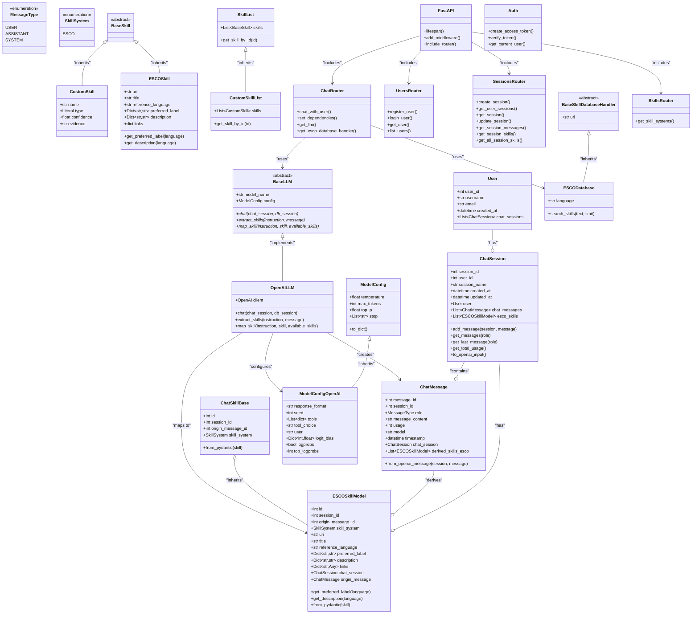

# UML Class Diagram - AI Chatbot Application

This document contains the UML class diagram for the AI chatbot application backend, showing the main classes, their relationships, and structure.

## Class Diagram

## Class Descriptions

### Database Models
- **User**: Represents application users with authentication and chat session management
- **ChatSession**: Manages chat conversations and their associated messages and skills
- **ChatMessage**: Individual messages within chat sessions with metadata
- **ESCOSkillModel**: ESCO skill mappings extracted from chat conversations
- **ChatSkillBase**: Abstract base class for different skill system implementations

### Core Classes
- **BaseLLM**: Abstract base class for LLM implementations
- **OpenAILLM**: Concrete OpenAI API implementation
- **BaseSkill**: Abstract base for skill representations
- **ESCOSkill**: ESCO skill data structure
- **CustomSkill**: User-defined skill extraction

### Configuration & Handlers
- **ModelConfig**: Base configuration for LLM models
- **ModelConfigOpenAI**: OpenAI-specific configuration options
- **BaseSkillDatabaseHandler**: Abstract base for skill database handlers
- **ESCODatabase**: ESCO API integration for skill search

### FastAPI Components
- **FastAPI**: Main application instance
- **UsersRouter**: User management endpoints
- **SessionsRouter**: Chat session management
- **ChatRouter**: Core chat functionality
- **SkillsRouter**: Skill-related endpoints
- **Auth**: JWT authentication and user verification

## Relationships

- **Composition**: Users have chat sessions, sessions contain messages and skills
- **Inheritance**: Multiple classes extend abstract base classes
- **Association**: Routers use LLM and database handlers
- **Dependency**: FastAPI includes various router modules
