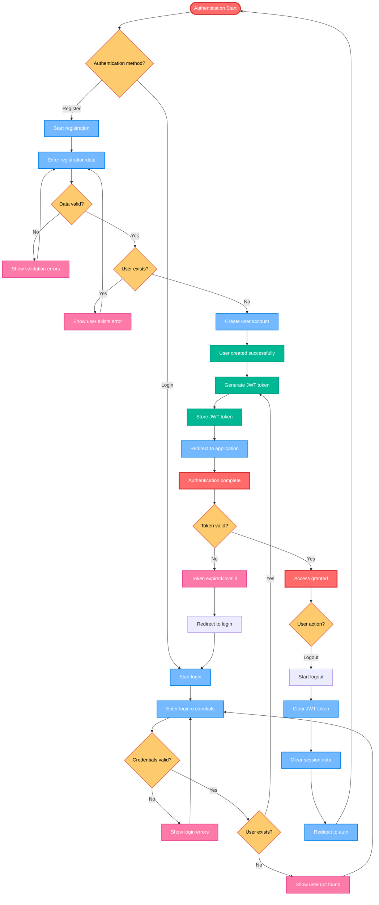
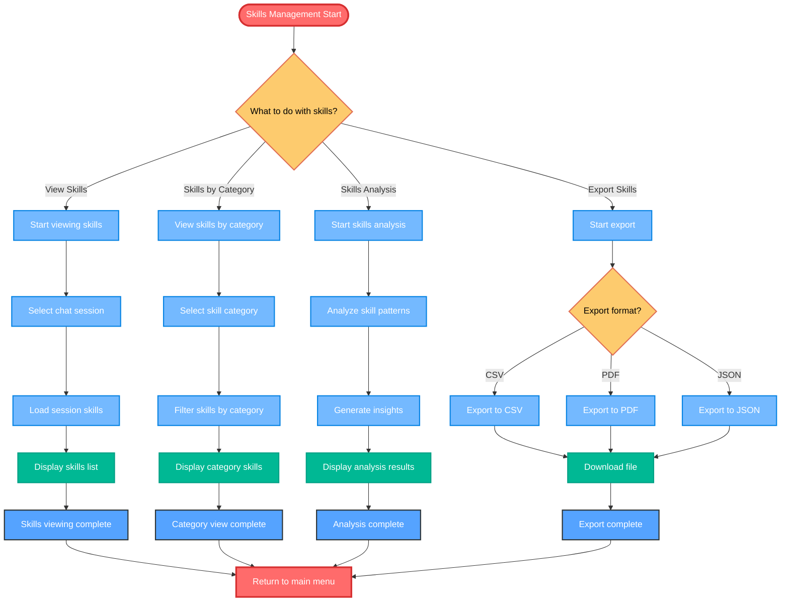

# User Flow Diagram - AI Chatbot Application

This document contains comprehensive user flow diagrams showing the complete user journey through the AI chatbot application, including all major interactions, decision points, and user paths.

## Main User Flow Diagram

```mermaid
flowchart TD
    Start([User arrives at application]) --> Landing{First time user?}
    
    %% New User Path
    Landing -->|Yes| Register[Register new account]
    Register --> EnterDetails[Enter username & email]
    EnterDetails --> ValidateRegistration{Validation successful?}
    ValidateRegistration -->|No| ShowError[Show error message]
    ShowError --> EnterDetails
    ValidateRegistration -->|Yes| AccountCreated[Account created successfully]
    
    %% Existing User Path
    Landing -->|No| Login[Login with existing account]
    Login --> EnterCredentials[Enter username]
    EnterCredentials --> ValidateLogin{Valid credentials?}
    ValidateLogin -->|No| ShowLoginError[Show login error]
    ShowLoginError --> EnterCredentials
    ValidateLogin -->|Yes| GenerateToken[Generate JWT token]
    
    %% Common Path After Authentication
    AccountCreated --> GenerateToken
    GenerateToken --> Dashboard[User Dashboard]
    
    %% Dashboard Options
    Dashboard --> DashboardChoice{What would you like to do?}
    
    %% Start New Chat
    DashboardChoice -->|Start New Chat| NewChat[Create new chat session]
    NewChat --> EnterSessionName[Enter session name optional]
    EnterSessionName --> ChatInterface[Chat Interface]
    
    %% Continue Existing Chat
    DashboardChoice -->|Continue Chat| ViewSessions[View existing sessions]
    ViewSessions --> SelectSession[Select chat session]
    SelectSession --> ChatInterface
    
    %% View Skills
    DashboardChoice -->|View Skills| SkillsOverview[Skills Overview]
    SkillsOverview --> SkillsBySession[View skills by session]
    SkillsBySession --> SelectSessionForSkills[Select session]
    SelectSessionForSkills --> DisplaySkills[Display extracted skills]
    DisplaySkills --> BackToDashboard[Return to Dashboard]
    
    %% Profile Management
    DashboardChoice -->|Manage Profile| ProfileOptions{Profile action?}
    ProfileOptions -->|View Profile| ShowProfile[Display user profile]
    ProfileOptions -->|Edit Profile| EditProfile[Edit profile information]
    EditProfile --> SaveProfile[Save changes]
    SaveProfile --> ProfileUpdated[Profile updated]
    ShowProfile --> BackToDashboard
    ProfileUpdated --> BackToDashboard
    
    %% Chat Interface Flow
    ChatInterface --> ChatChoice{Chat action?}
    
    %% Send Message
    ChatChoice -->|Send Message| TypeMessage[Type message]
    TypeMessage --> ValidateMessage{Message valid?}
    ValidateMessage -->|No| ShowMessageError[Show validation error]
    ShowMessageError --> TypeMessage
    ValidateMessage -->|Yes| SendMessage[Send message to AI]
    
    %% AI Processing
    SendMessage --> AIProcessing[AI processing...]
    AIProcessing --> ExtractSkills[Extract skills from message]
    ExtractSkills --> MapSkills[Map to ESCO skills]
    MapSkills --> GenerateResponse[Generate AI response]
    
    %% Display Results
    GenerateResponse --> DisplayResponse[Display AI response]
    DisplayResponse --> DisplaySkillsInChat[Display extracted skills]
    DisplaySkillsInChat --> ContinueChat{Continue chatting?}
    
    %% Continue or End Chat
    ContinueChat -->|Yes| ChatChoice
    ContinueChat -->|No| EndChat[End chat session]
    EndChat --> SaveSession[Save session data]
    SaveSession --> SessionSaved[Session saved]
    SessionSaved --> BackToDashboard
    
    %% Session Management
    ViewSessions --> SessionAction{Session action?}
    SessionAction -->|Open Session| SelectSession
    SessionAction -->|Delete Session| ConfirmDelete[Confirm deletion]
    ConfirmDelete --> DeleteSession[Delete session]
    DeleteSession --> SessionDeleted[Session deleted]
    SessionDeleted --> ViewSessions
    SessionAction -->|Rename Session| RenameSession[Enter new name]
    RenameSession --> UpdateSessionName[Update session name]
    UpdateSessionName --> NameUpdated[Name updated]
    NameUpdated --> ViewSessions
    
    %% Return to Dashboard
    BackToDashboard --> DashboardChoice
    
    %% Logout
    DashboardChoice -->|Logout| ConfirmLogout[Confirm logout]
    ConfirmLogout --> Logout[Clear session & logout]
    Logout --> Start
    
    %% Styling
    classDef startEnd fill:#ff6b6b,stroke:#d63031,stroke-width:3px,color:#fff
    classDef process fill:#74b9ff,stroke:#0984e3,stroke-width:2px,color:#fff
    classDef decision fill:#fdcb6e,stroke:#e17055,stroke-width:2px,color:#000
    classDef data fill:#55a3ff,stroke:#2d3436,stroke-width:2px,color:#fff
    classDef error fill:#fd79a8,stroke:#e84393,stroke-width:2px,color:#fff
    classDef success fill:#00b894,stroke:#00a085,stroke-width:2px,color:#fff
    
    class Start,EndChat,Logout startEnd
    class Register,Login,EnterDetails,EnterCredentials,NewChat,EnterSessionName,ChatInterface,TypeMessage,SendMessage,AIProcessing,ExtractSkills,MapSkills,GenerateResponse,DisplayResponse,DisplaySkillsInChat,SaveSession,ViewSessions,SelectSession,SkillsOverview,SkillsBySession,SelectSessionForSkills,DisplaySkills,ShowProfile,EditProfile,SaveProfile,DeleteSession,RenameSession,UpdateSessionName process
    class Landing,ValidateRegistration,ValidateLogin,ValidateMessage,DashboardChoice,ContinueChat,SessionAction,ProfileOptions,ConfirmDelete,ConfirmLogout decision
    class Dashboard,AccountCreated,GenerateToken,ProfileUpdated,SessionSaved,SessionDeleted,NameUpdated data
    class ShowError,ShowLoginError,ShowMessageError error
    class ChatInterface,DisplayResponse,DisplaySkillsInChat success
```

## Detailed Chat Flow Diagram

```mermaid
flowchart TD
    StartChat([User starts chat]) --> InitSession{New or existing session?}
    
    %% New Session Flow
    InitSession -->|New| CreateSession[Create new session]
    CreateSession --> SetSessionName[Set session name]
    SetSessionName --> SessionReady[Session ready]
    
    %% Existing Session Flow
    InitSession -->|Existing| LoadSession[Load existing session]
    LoadSession --> LoadHistory[Load chat history]
    LoadHistory --> SessionReady
    
    %% Chat Loop
    SessionReady --> ChatLoop[Chat Loop]
    ChatLoop --> UserInput[User types message]
    UserInput --> ValidateInput{Message valid?}
    ValidateInput -->|No| ShowValidationError[Show validation error]
    ShowValidationError --> UserInput
    
    ValidateInput -->|Yes| SaveUserMessage[Save user message to DB]
    SaveUserMessage --> PrepareContext[Prepare chat context]
    PrepareContext --> CallOpenAI[Call OpenAI API]
    
    %% OpenAI Processing
    CallOpenAI --> AIResponse[Receive AI response]
    AIResponse --> ParseResponse[Parse AI response]
    ParseResponse --> SaveAIResponse[Save AI response to DB]
    SaveAIResponse --> UpdateSession[Update session timestamp]
    
    %% Skill Extraction Process
    UpdateSession --> StartSkillExtraction[Start skill extraction]
    StartSkillExtraction --> ExtractSkillsPrompt[Send skill extraction prompt]
    ExtractSkillsPrompt --> CallOpenAISkills[Call OpenAI for skills]
    CallOpenAISkills --> ParseSkills[Parse extracted skills]
    
    %% Skill Mapping Process
    ParseSkills --> MapToESCO[Map skills to ESCO]
    MapToESCO --> SearchESCO[Search ESCO database]
    SearchESCO --> GetESCOResults[Get ESCO results]
    GetESCOResults --> MapSkillsPrompt[Send skill mapping prompt]
    MapSkillsPrompt --> CallOpenAIMapping[Call OpenAI for mapping]
    CallOpenAIMapping --> ParseMapping[Parse skill mapping]
    ParseMapping --> SaveMappedSkills[Save mapped skills to DB]
    
    %% Display Results
    SaveMappedSkills --> DisplayAIResponse[Display AI response]
    DisplayAIResponse --> DisplaySkills[Display extracted skills]
    DisplaySkills --> UpdateUI[Update chat interface]
    
    %% Continue or End
    UpdateUI --> ContinueChat{Continue chatting?}
    ContinueChat -->|Yes| ChatLoop
    ContinueChat -->|No| EndSession[End chat session]
    EndSession --> SaveFinalState[Save final session state]
    SaveFinalState --> ReturnToDashboard[Return to dashboard]
    
    %% Error Handling
    CallOpenAI -->|Error| HandleAPIError[Handle API error]
    HandleAPIError --> ShowAPIError[Show error message]
    ShowAPIError --> ChatLoop
    
    CallOpenAISkills -->|Error| HandleSkillError[Handle skill extraction error]
    HandleSkillError --> SkipSkills[Skip skill extraction]
    SkipSkills --> DisplayAIResponse
    
    CallOpenAIMapping -->|Error| HandleMappingError[Handle mapping error]
    HandleMappingError --> SkipMapping[Skip skill mapping]
    SkipMapping --> DisplayAIResponse
    
    %% Styling
    classDef startEnd fill:#ff6b6b,stroke:#d63031,stroke-width:3px,color:#fff
    classDef process fill:#74b9ff,stroke:#0984e3,stroke-width:2px,color:#fff
    classDef decision fill:#fdcb6e,stroke:#e17055,stroke-width:2px,color:#000
    classDef data fill:#55a3ff,stroke:#2d3436,stroke-width:2px,color:#fff
    classDef error fill:#fd79a8,stroke:#e84393,stroke-width:2px,color:#fff
    classDef success fill:#00b894,stroke:#00a085,stroke-width:2px,color:#fff
    
    class StartChat,EndSession,ReturnToDashboard startEnd
    class CreateSession,SetSessionName,LoadSession,LoadHistory,UserInput,SaveUserMessage,PrepareContext,CallOpenAI,AIResponse,ParseResponse,SaveAIResponse,UpdateSession,StartSkillExtraction,ExtractSkillsPrompt,CallOpenAISkills,ParseSkills,MapToESCO,SearchESCO,GetESCOResults,MapSkillsPrompt,CallOpenAIMapping,ParseMapping,SaveMappedSkills,DisplayAIResponse,DisplaySkills,UpdateUI,SaveFinalState process
    class InitSession,ValidateInput,ContinueChat decision
    class SessionReady,ChatLoop,SessionReady data
    class ShowValidationError,HandleAPIError,ShowAPIError,HandleSkillError,HandleMappingError error
    class DisplayAIResponse,DisplaySkills success
```

## Authentication Flow Diagram

## Skills Management Flow Diagram

## User Journey Summary

### **1. Onboarding Journey**
- **First Visit**: User arrives and registers new account
- **Account Creation**: Username and email validation
- **Initial Setup**: Account created and JWT token generated

### **2. Authentication Journey**
- **Login Process**: Username-based authentication
- **Token Management**: JWT token generation and storage
- **Session Security**: Token validation on each request

### **3. Chat Experience Journey**
- **Session Management**: Create new or continue existing chats
- **Message Exchange**: Real-time chat with AI
- **Skill Extraction**: Automatic skill identification
- **ESCO Mapping**: Professional skill classification

### **4. Skills Management Journey**
- **Skills Viewing**: Browse extracted skills by session
- **Skills Analysis**: Pattern recognition and insights
- **Skills Export**: Multiple format export options

### **5. Profile Management Journey**
- **Profile Viewing**: Display user information
- **Profile Editing**: Update user details
- **Session History**: Manage chat sessions

### **6. Error Handling Journey**
- **Validation Errors**: Input validation feedback
- **API Errors**: Graceful error handling
- **Network Issues**: Connection error management

## Key User Experience Features

1. **Seamless Onboarding**: Simple registration and login process
2. **Intuitive Chat Interface**: Easy-to-use chat experience
3. **Real-time Processing**: Immediate AI responses and skill extraction
4. **Comprehensive Skills View**: Multiple ways to explore extracted skills
5. **Session Persistence**: Complete conversation history
6. **Error Recovery**: Clear error messages and recovery paths
7. **Responsive Design**: Works across different devices
8. **Export Functionality**: Multiple format options for skills data

## User Decision Points

- **Authentication Method**: Register new account vs. login existing
- **Session Management**: New chat vs. continue existing
- **Skills Exploration**: View by session vs. by category vs. analysis
- **Export Preferences**: CSV, PDF, or JSON format
- **Chat Continuation**: Continue chatting vs. end session
- **Profile Actions**: View vs. edit profile information
