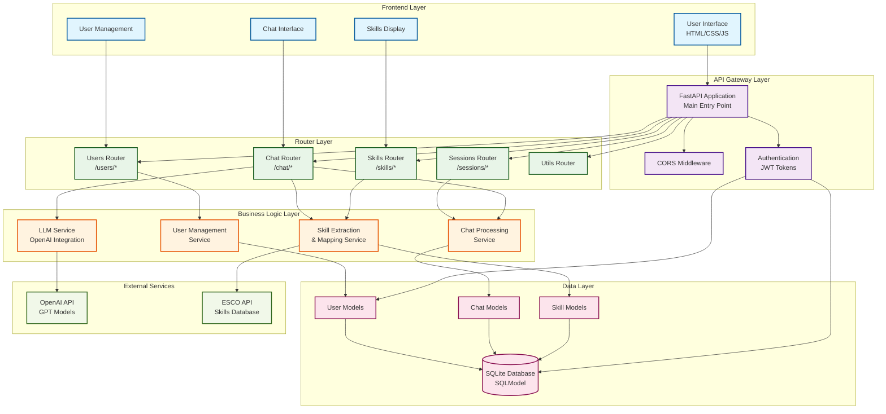
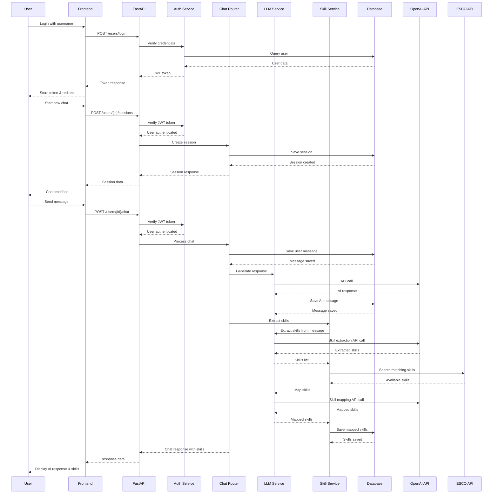
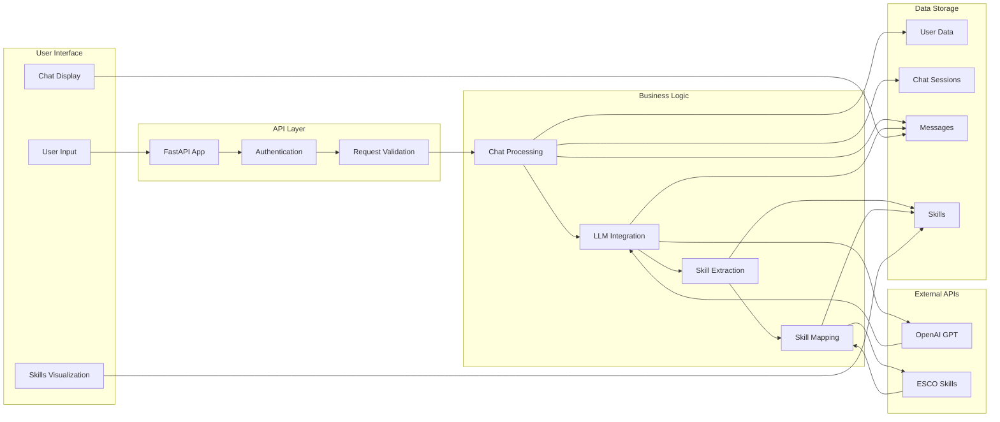

# Web Diagram - AI Chatbot Application Architecture

This document contains a comprehensive web diagram showing the system architecture, data flow, and component interactions for the AI chatbot application.

## System Architecture Diagram



## Data Flow Diagram



## Component Interaction Diagram



## Technology Stack Overview

### Frontend
- **HTML/CSS/JavaScript**: Static web interface
- **Chat Interface**: Real-time chat functionality
- **User Management**: Registration, login, profile
- **Skills Display**: Visual representation of extracted skills

### Backend
- **FastAPI**: Modern Python web framework
- **SQLModel**: SQL database ORM with Pydantic
- **JWT Authentication**: Secure user authentication
- **CORS Middleware**: Cross-origin resource sharing

### AI Integration
- **OpenAI API**: GPT model integration
- **Custom Prompts**: Skill extraction and mapping
- **Response Parsing**: Structured output handling

### Data Management
- **SQLite Database**: Local data storage
- **ESCO API**: European Skills/Competences database
- **Skill Mapping**: AI-powered skill matching

### Architecture Patterns
- **RESTful API**: Standard HTTP endpoints
- **Dependency Injection**: Service layer management
- **Repository Pattern**: Data access abstraction
- **Middleware Architecture**: Request/response processing

## Key Features

1. **User Authentication**: JWT-based secure login
2. **Chat Sessions**: Persistent conversation management
3. **AI Integration**: OpenAI GPT model integration
4. **Skill Extraction**: Automatic skill identification from conversations
5. **ESCO Mapping**: Professional skill classification
6. **Real-time Processing**: Immediate AI responses
7. **Data Persistence**: Complete conversation history
8. **Scalable Architecture**: Modular component design
```

## System Flow Summary

The application follows a **layered architecture** pattern:

1. **Frontend Layer**: User interface for interaction
2. **API Gateway**: FastAPI application with middleware
3. **Router Layer**: Endpoint organization and routing
4. **Business Logic**: Core application services
5. **Data Layer**: Database models and persistence
6. **External Services**: OpenAI and ESCO API integration

**Data flows** from user input through authentication, processing, AI integration, skill extraction, and back to the user with enriched responses and skill mappings.
